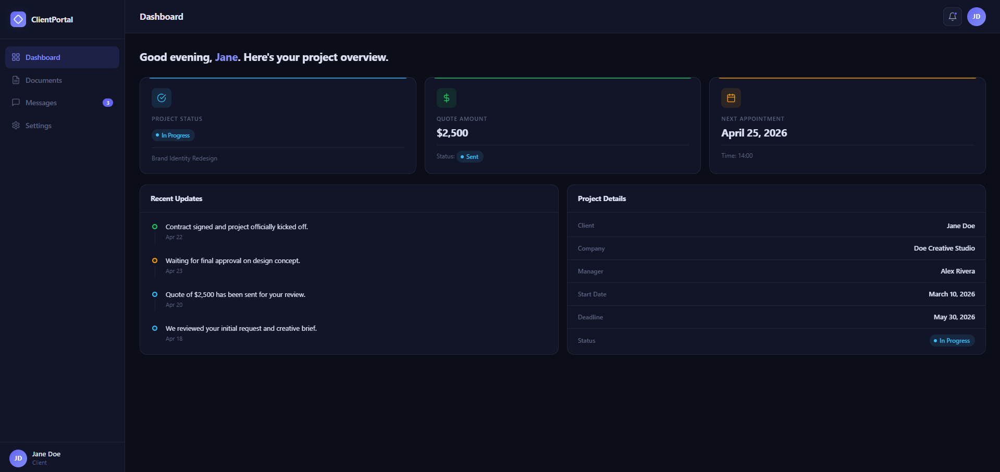
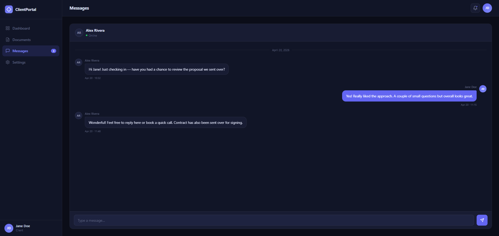
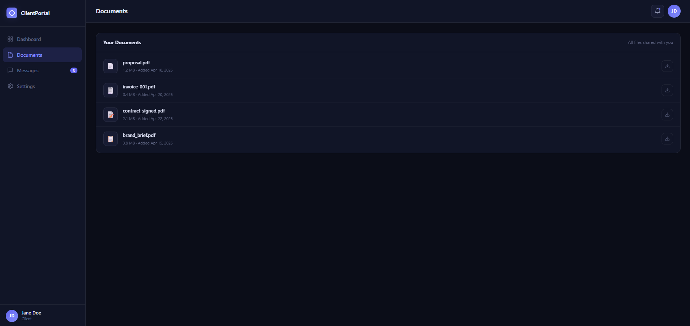
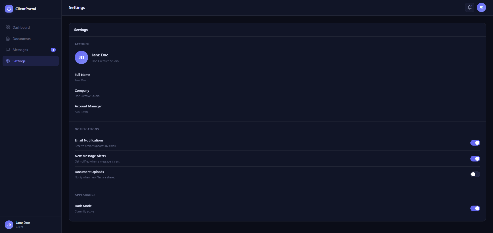

# CNR Client Portal

A modern, dark-mode client portal dashboard built with pure HTML, CSS, and vanilla JavaScript — no frameworks, no dependencies.

Designed as a professional client-facing interface for freelancers and agencies to present project status, documents, and communication in one clean experience.

---

## Features

- **Dashboard** — Project status badge, quote summary, next appointment card, and recent project updates timeline
- **Documents** — Shared file list with metadata (size, date) and simulated download interaction
- **Messages** — Real-time-style chat UI with typing indicator and auto-reply simulation
- **Settings** — Account details, notification preferences, and dark mode toggle
- **Dynamic rendering** — All content driven from a single JS data object (easy to swap for a real API)
- **Status badges** — Color-coded labels: Approved, In Progress, Pending, Rejected
- **Smooth transitions** — Fade-up animations on view switch, hover states throughout
- **Zero dependencies** — Delivered as 3 files, works offline, no build step required

---

## Screenshots

### Dashboard



### Messages



### Documents



### Settings



---

## Tech Stack

| Layer      | Technology          |
|------------|---------------------|
| Structure  | HTML5               |
| Styling    | CSS3 (custom properties, flexbox, grid) |
| Logic      | Vanilla JavaScript (ES6+) |
| Design     | Dark mode, CSS design tokens |

---

## Project Structure

```
cnr-client-portal/
├── index.html    # App shell and all four view sections
├── style.css     # Full design system — tokens, layout, components, animations
└── app.js        # Data objects, render functions, navigation, chat logic
```

---

## Installation

```bash
git clone https://github.com/cnrakpinar1-jpg/cnr-client-portal.git
cd cnr-client-portal
```

Then open `index.html` in your browser. No server required.

---

## Usage

Client data is defined at the top of `app.js`:

```js
const client = {
  name:        'Jane Doe',
  company:     'Doe Creative Studio',
  project:     'Brand Identity Redesign',
  status:      'in-progress',
  quote:        2500,
  quoteStatus: 'sent',
  startDate:   'March 10, 2026',
  deadline:    'May 30, 2026',
  nextMeeting: { date: 'April 25, 2026', time: '14:00' },
  manager:     'Alex Rivera',
};
```

Update this object and the `updates[]` / `documents[]` arrays to reflect any client's project. In a real deployment, these would be fetched from an API.

---

## Future Improvements

- Mobile-responsive layout for smaller screens
- Backend integration (Node.js, Supabase, or similar)
- Persistent messages and data storage
- Real document preview and signed-URL downloads
- Improved accessibility for toggle switches and interactive elements

---

## Author

**CNR Akpinar**
[github.com/cnrakpinar1-jpg](https://github.com/cnrakpinar1-jpg)

---

## GitHub Pages Deployment

This repo is a static HTML/CSS/JavaScript project and `index.html` lives in the repository root, so it is ready for GitHub Pages.

### Deployment Steps

1. Push changes to the `main` branch.
2. In **Settings > Pages**, enable GitHub Pages for this repository.
3. Set the source to **GitHub Actions** to use the included `.github/workflows/deploy-pages.yml` workflow.
4. After the workflow finishes, the live site will be available at:

`https://cnrakpinar1-jpg.github.io/cnr-client-portal/`
